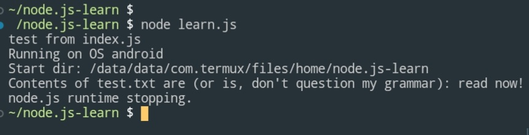

# Learn-node.js

just a little side project to learn Java script:D
**All it can do so far is this:**

Not much:/

I might be focusing more on Java, but come to this whenever I feel bored or want to work on it!
